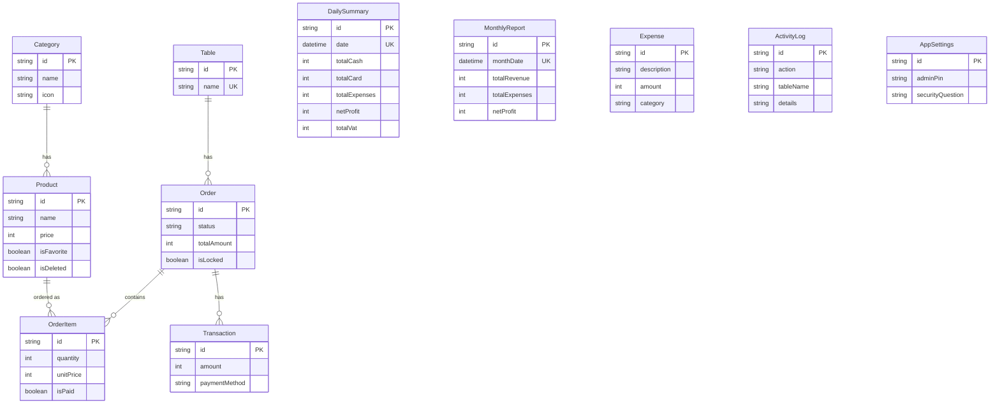

<p align="center">
  
</p>

<h1 align="center">☕ Caffio</h1>

<p align="center">
  <strong>Modern Kafe & Restoran Adisyon Sistemi</strong>
</p>

<p align="center">
  <em>Hızlı, çevrim dışı çalışabilen, modern teknolojilerle geliştirilmiş masaüstü POS uygulaması</em>
</p>

<p align="center">
  
  
  
  
  
</p>

<p align="center">
  
  
  
  <a href="https://github.com/baranyalcinn/cafe-adisyon/actions"></a>
</p>

---

## ✨ Özellikler

### 🛒 Sipariş & POS

- **Dokunmatik Dostu Arayüz** — Hızlı sipariş oluşturma, düzenleme ve takip
- **Akıllı Ürün Kataloğu** — Kategorilere ayrılmış, ikonlu ürün yönetimi
- **Favori Ürünler** — Sık sipariş edilen ürünlere anında erişim
- **Anlık Sepet Güncellemeleri** — Animasyonlu miktar seçici ve gerçek zamanlı hesaplama

### 🪑 Masa Yönetimi

- **Görsel Masa Düzeni** — Tüm masaların durumunu tek bakışta görün (boş / dolu / kilitli)
- **Sipariş Bağlama** — Siparişleri masalara kolayca atayın
- **Çoklu Sipariş Desteği** — Bir masada aynı anda birden fazla açık sipariş
- **Sağ Tık Menüsü** — Masa üzerinden hızlı işlem (kilitle, hesap kes, sipariş ekle)

### 💳 Ödeme İşleme

- **Çoklu Ödeme Yöntemi** — Nakit ve kredi kartı desteği
- **Adisyon Bölme** — Hesabı farklı ödeme yöntemlerine bölebilme
- **Kısmi Ödeme** — Ürün bazında ayrı ayrı ödeme alma
- **İşlem Geçmişi** — Tüm ödemelerin detaylı denetim kaydı

### 📊 Dashboard & Raporlama

- **Gerçek Zamanlı Dashboard** — Anlık satış metrikleri, günlük ve aylık özetler
- **Günlük Z-Raporu** — Gün sonu kasa kapama raporu (nakit, kart, KDV, gider, net kâr)
- **Aylık Raporlar** — Gelir, gider ve net kâr trendlerini takip edin
- **Grafik Görselleştirme** — Recharts ile interaktif gelir grafikleri

### ⚙️ Yönetim Paneli (PIN Korumalı)

| Sekme           | İşlev                                            |
| --------------- | ------------------------------------------------ |
| **Masalar**     | Masa ekleme, silme, düzenleme                    |
| **Kategoriler** | Ürün kategorisi yönetimi (ikon seçimi ile)       |
| **Ürünler**     | Ürün CRUD işlemleri, fiyat ve kategori atama     |
| **Giderler**    | İşletme giderlerini kaydetme ve kategorize etme  |
| **Bakım**       | Veritabanı sıfırlama, Z-raporu arşivleme         |
| **Kayıtlar**    | Tüm sistem aktivitelerinin detaylı denetim kaydı |

### 🎨 Premium Kullanıcı Deneyimi

- **Glassmorphism Tasarım** — Modern, yarı saydam arayüz elemanları
- **Akıcı Animasyonlar** — Framer Motion ile sayfa geçişleri ve mikro-animasyonlar
- **Karanlık Mod** — Uzun vardiyalarda göz yorgunluğunu azaltır
- **Özel Başlık Çubuğu** — Frameless pencere, özel minimize/maximize/close butonları
- **GPU Hızlandırma** — Maksimum render performansı
- **Ses Efektleri** — İşlem tamamlama sesli geri bildirimi

---

## 🏛️ Mimari

```
┌─────────────────────────────────────────────────────────┐
│                    Renderer (React 19)                   │
│                                                         │
│  ┌─────────┐ ┌────────┐ ┌──────────┐ ┌───────────────┐ │
│  │ Zustand  │ │TanStack│ │  Framer  │ │   Radix UI    │ │
│  │ Stores(4)│ │ Query  │ │ Motion   │ │ Components(21)│ │
│  └─────────┘ └────────┘ └──────────┘ └───────────────┘ │
│                                                         │
│  Features: Dashboard│Orders│Payments│Tables│Settings    │
│            Reports                                      │
├──────────────── Secure IPC Bridge (Zod) ────────────────┤
│                   Preload (Context Isolation)            │
├─────────────────────────────────────────────────────────┤
│                  Main Process (Electron 40)              │
│                                                         │
│  ┌──────────────────┐  ┌──────────────────────────────┐ │
│  │   9 IPC Handlers │  │      7 Backend Services      │ │
│  │  ───────────────  │  │  ────────────────────────── │ │
│  │  • Order          │  │  • OrderService     (20KB)  │ │
│  │  • Table          │  │  • MaintenanceService       │ │
│  │  • Product        │  │  • ReportingService (15KB)  │ │
│  │  • Category       │  │  • AdminService             │ │
│  │  • Payment/Report │  │  • ProductService           │ │
│  │  • Admin/Expense  │  │  • ExpenseService           │ │
│  │  • Log/Maint.     │  │  • LogService               │ │
│  └──────────────────┘  └──────────────────────────────┘ │
│                                                         │
│  ┌─────────────────────────────────────────────────────┐ │
│  │         Prisma 7.4 ORM + LibSQL (SQLite)            │ │
│  │   10 Models: Product│Category│Table│Order│OrderItem │ │
│  │   Transaction│DailySummary│ActivityLog│Expense│...   │ │
│  └─────────────────────────────────────────────────────┘ │
└─────────────────────────────────────────────────────────┘
```

---

## 🛠️ Teknoloji Yığını

| Katman             | Teknoloji                                                                                             |
| ------------------ | ----------------------------------------------------------------------------------------------------- |
| **Framework**      | [Electron](https://www.electronjs.org/) 40 + [electron-vite](https://electron-vite.org/) 5            |
| **Frontend**       | [React](https://react.dev/) 19 + [TypeScript](https://www.typescriptlang.org/) 5.9                    |
| **Stil**           | [Tailwind CSS](https://tailwindcss.com/) 4 + [Radix UI](https://www.radix-ui.com/) Primitives         |
| **Durum Yönetimi** | [Zustand](https://zustand.docs.pmnd.rs/) 5 (4 store) + [TanStack Query](https://tanstack.com/query) 5 |
| **Veritabanı**     | [Prisma](https://www.prisma.io/) 7.4 Client Engine + [LibSQL](https://turso.tech/libsql) (SQLite)     |
| **Animasyonlar**   | [Framer Motion](https://www.framer.com/motion/) 12                                                    |
| **Grafikler**      | [Recharts](https://recharts.org/) 3                                                                   |
| **Doğrulama**      | [Zod](https://zod.dev/) 4                                                                             |
| **Test**           | [Vitest](https://vitest.dev/) 4 + [Playwright](https://playwright.dev/)                               |
| **Build**          | [electron-builder](https://www.electron.build/) 26 (NSIS Installer)                                   |
| **CI/CD**          | [GitHub Actions](https://github.com/features/actions) (Windows, otomatik artifact)                    |

---

## 🚀 Başlarken

### Gereksinimler

- **Node.js** 20.x veya üstü
- **npm** 10.x veya üstü
- **Git**

### Kurulum

```bash
# 1. Repo'yu klonla
git clone https://github.com/baranyalcinn/cafe-adisyon.git
cd cafe-adisyon

# 2. Bağımlılıkları yükle
npm install

# 3. Veritabanını hazırla
npx prisma generate
npx prisma db push

# 4. Geliştirme sunucusunu başlat
npm run dev
```

> **Not:** `bufferutil` ve `utf-8-validate` opsiyonel native modüllerdir. Visual Studio Build Tools yoksa uyarı verebilir ama uygulama yine de sorunsuz çalışır.

---

## 📁 Proje Yapısı

```
cafe-adisyon/
├── 📂 src/
│   ├── 📂 main/                    # Electron ana süreç
│   │   ├── index.ts                # Uygulama giriş noktası + pencere yönetimi
│   │   ├── 📂 db/                  # Prisma istemci yapılandırması
│   │   ├── 📂 ipc/                 # IPC yönlendirici + 9 handler modülü
│   │   │   └── 📂 routes/          # order, table, product, category, payment,
│   │   │                           # admin, expense, log, maintenance, reporting
│   │   ├── 📂 services/            # İş mantığı katmanı (7 servis)
│   │   │   ├── OrderService.ts     # Sipariş CRUD, ürün ekleme/çıkarma, kilitleme
│   │   │   ├── ReportingService.ts # Z-raporu, aylık rapor, dashboard verileri
│   │   │   ├── MaintenanceService.ts # DB bakım, veri sıfırlama, arşivleme
│   │   │   ├── AdminService.ts     # PIN yönetimi, güvenlik sorusu
│   │   │   ├── ProductService.ts   # Ürün & favori yönetimi
│   │   │   ├── ExpenseService.ts   # Gider kayıt ve takip
│   │   │   └── LogService.ts       # Aktivite loglama (kuyruk sistemi)
│   │   └── 📂 lib/                 # Logger, DB bakım cron
│   ├── 📂 preload/                 # Güvenli IPC köprüsü (Context Isolation)
│   ├── 📂 renderer/                # React frontend
│   │   └── 📂 src/
│   │       ├── App.tsx             # Ana layout, sidebar navigasyon, sayfa geçişleri
│   │       ├── 📂 features/        # Feature-based modüler yapı
│   │       │   ├── dashboard/      # Gerçek zamanlı satış metrikleri
│   │       │   ├── orders/         # POS arayüzü, sepet, ürün seçimi
│   │       │   ├── payments/       # Ödeme işleme, adisyon bölme
│   │       │   ├── reports/        # Aylık rapor görünümleri
│   │       │   ├── settings/       # 6 sekmeli yönetim paneli
│   │       │   └── tables/         # Görsel masa düzeni
│   │       ├── 📂 components/      # Paylaşılan UI bileşenleri (21 Radix tabanlı)
│   │       ├── 📂 hooks/           # useOrder, useInventory, useTables, useSound, useTheme
│   │       ├── 📂 store/           # Zustand mağazaları (cart, table, settings, toast)
│   │       ├── 📂 services/        # Renderer-side IPC servis çağrıları (9 modül)
│   │       └── 📂 lib/             # Yardımcı fonksiyonlar, utils
│   └── 📂 shared/                  # Paylaşılan tipler ve sabitler
├── 📂 prisma/
│   └── schema.prisma               # 10 model: Product, Category, Table, Order, vb.
├── 📂 .github/workflows/
│   └── build.yml                   # GitHub Actions CI/CD (Windows NSIS build)
├── 📂 build/                       # Platform ikonları (ico, icns, png)
├── 📂 scripts/                     # DB reset betikleri
├── electron-builder.yml            # Build yapılandırması (ASAR, NSIS, code signing)
├── electron.vite.config.ts         # Vite yapılandırması (main + preload + renderer)
└── package.json
```

---

## 📜 Kullanılabilir Scriptler

| Komut                   | Açıklama                                       |
| ----------------------- | ---------------------------------------------- |
| `npm run dev`           | HMR ile geliştirme sunucusu başlat             |
| `npm run build`         | Prisma generate + typecheck + production build |
| `npm run build:win`     | Windows `.exe` installer oluştur (NSIS)        |
| `npm run build:mac`     | macOS `.dmg` oluştur                           |
| `npm run build:linux`   | Linux AppImage oluştur                         |
| `npm run lint`          | ESLint ile kod analizi                         |
| `npm run format`        | Prettier ile kod biçimlendirme                 |
| `npm run test`          | Vitest ile birim testleri çalıştır             |
| `npm run typecheck`     | TypeScript tip kontrolü (node + web)           |
| `npm run db:reset`      | Veritabanını tamamen sıfırla ⚠️                |
| `npm run db:soft-reset` | Veritabanını yumuşak sıfırla                   |

---

## 🧪 Test

```bash
# Tüm testleri çalıştır
npm run test

# İzleme modunda çalıştır
npm run test -- --watch

# Kapsam raporuyla çalıştır
npm run test -- --coverage
```

- **Birim Testler:** Vitest 4 + Testing Library
- **Tarayıcı Testleri:** Playwright + `@vitest/browser-playwright`
- **Kapsam:** `@vitest/coverage-v8`

---

## 🏗️ Production Build

### Windows

```bash
npm run build:win
```

Çıktı: `dist/Caffio-Setup-1.0.0.exe` (NSIS installer)

**Build özellikleri:**

- ASAR paketleme (native modüller hariç tutulur)
- Maksimum sıkıştırma
- Masaüstü kısayolu oluşturma
- Özel kurulum dizini seçme
- Prisma şeması ve veritabanı `extraResources` olarak dahil

### CI/CD (GitHub Actions)

Her `main` branch push'unda otomatik build tetiklenir:

1. Bağımlılık kurulumu (`npm install --legacy-peer-deps`)
2. Prisma generate + Native rebuild
3. TypeScript build
4. Node modules cerrahi budaması (yalnızca runtime deps)
5. `electron-builder` ile NSIS installer oluşturma
6. Artifact olarak GitHub'a yükleme (5 gün saklama)

---

## 🗄️ Veritabanı Şeması



---

## 🔒 Güvenlik

| Önlem                   | Açıklama                                                |
| ----------------------- | ------------------------------------------------------- |
| **Context Isolation**   | Renderer süreci Node.js'ten tamamen izole               |
| **Güvenli IPC**         | Tüm süreçler arası iletişim Zod şemalarıyla doğrulanır  |
| **CSP Başlıkları**      | Content Security Policy ile XSS saldırılarını önler     |
| **PIN Koruması**        | Yönetim fonksiyonları PIN kimlik doğrulamasıyla korunur |
| **Güvenlik Sorusu**     | PIN unutma durumunda kurtarma mekanizması               |
| **Çevrim Dışı Çalışma** | Runtime'da harici bağımlılık yok, tamamen offline       |
| **Frameless Pencere**   | Özel başlık çubuğu, DevTools production'da devre dışı   |
| **Graceful Shutdown**   | Uygulama kapanırken DB bağlantısı güvenle kapatılır     |

---

## 🔧 Geliştirme Ortamı

### Önerilen VS Code Eklentileri

- [ESLint](https://marketplace.visualstudio.com/items?itemName=dbaeumer.vscode-eslint) — Kod analizi
- [Prettier](https://marketplace.visualstudio.com/items?itemName=esbenp.prettier-vscode) — Otomatik biçimlendirme
- [Tailwind CSS IntelliSense](https://marketplace.visualstudio.com/items?itemName=bradlc.vscode-tailwindcss) — CSS tamamlama
- [Prisma](https://marketplace.visualstudio.com/items?itemName=Prisma.prisma) — Şema desteği

### Proje Kuralları

- **TypeScript Strict Mode** — Tüm kodlar tip güvenli
- **ESLint** — `@electron-toolkit` + `@eslint-react` kural setleri
- **Prettier** — Otomatik kod biçimlendirme
- **Feature-Based Architecture** — Her özellik kendi dizininde yaşar

---

## 🤝 Katkıda Bulunma

1. Repository'yi fork edin
2. Feature branch oluşturun (`git checkout -b feature/harika-ozellik`)
3. Değişikliklerinizi commit edin (`git commit -m 'Harika özellik ekle'`)
4. Branch'i push edin (`git push origin feature/harika-ozellik`)
5. Pull Request açın

---

## 📄 Lisans

Bu proje **MIT Lisansı** ile lisanslanmıştır — detaylar için [LICENSE](LICENSE) dosyasına bakın.

---

## 👨‍💻 Geliştirici

**Baran**

- GitHub: [@baranyalcinn](https://github.com/baranyalcinn)

---

<p align="center">
  ☕ ile yapıldı — <strong>Caffio</strong>
</p>
