<p align="center">
  
</p>

<h1 align="center">☕ Caffio</h1>

<p align="center">
  <strong>Modern Cafe &amp; Restaurant Point-of-Sale System</strong>
</p>

<p align="center">
  <em>A lightning-fast, offline-first POS application built with cutting-edge web technologies.</em>
</p>

<p align="center">
  
  
  
  
  
</p>

<p align="center">
  
  
  
  <a href="https://github.com/baranyalcinn/cafe-adisyon/actions"></a>
</p>

---

## ✨ Features

### 🛒 Ordering & POS

- **Touch-Friendly Interface** — Fast order creation, editing, and tracking with GPU-accelerated animations
- **Smart Product Catalog** — Categorized product management with rich icons and dynamic color coding
- **Favorite Products** — Instant access tab for frequently ordered items
- **Real-Time Cart** — Debounced quantity stepper, optimistic UI updates, zero-flicker experience
- **Infinite Scroll** — Product grid loads in chunks of 40 via `IntersectionObserver` — no virtual list overhead

### 🪑 Table Management

- **Visual Table Layout** — View all table statuses at a glance (empty / occupied / locked)
- **Order Linking** — Seamlessly assign orders to specific tables
- **Table Locking** — Prevent accidental modifications during service
- **Context Menu** — Quick actions via right-click (lock, checkout, view order)

### 💳 Payment Processing

- **Multi-Method Payments** — Cash and Credit Card support
- **Split Bill** — Split the check evenly across N people with automatic remainder distribution
- **Item-Level Payments** — Pay for specific items individually, leaving the rest open
- **Auto Order Close** — When a partial payment covers the remaining balance after item removal, the order auto-closes
- **Transaction History** — Full audit trail of all payment records per order

### 📊 Dashboard & Reporting

- **Real-Time Dashboard** — Live sales metrics, daily totals, payment method breakdown
- **Interactive Charts** — Hourly activity (smart-cropped to business hours), top products, category pie, monthly trend
- **Daily Z-Report** — End-of-day register closure (cash, card, VAT, expenses, net profit)
- **Monthly Reports** — Revenue, expense, and net profit trend analysis
- **End-of-Day Automation** — Scheduled `node-cron` job captures daily snapshots automatically

### ⚙️ Administration Panel (PIN Protected)

| Tab             | Function                                            |
| --------------- | --------------------------------------------------- |
| **Tables**      | Add, remove, and edit tables                        |
| **Categories**  | Manage product categories with icon selection       |
| **Products**    | Product CRUD — price, category, and favorite toggle |
| **Expenses**    | Record and categorize operational expenses          |
| **Maintenance** | Database reset, Z-Report archiving                  |
| **Logs**        | Detailed audit log of all system activities         |

### 🎨 Premium User Experience

- **Minimalist High-Contrast Design** — Professional POS aesthetics built for readability under field conditions
- **Dark Mode** — Full theme system (`next-themes`) with persistent preference
- **Custom Title Bar** — Frameless window with custom minimize/maximize/close controls
- **Sound Effects** — Audio feedback via `Web Audio API` for cart actions and payment completion
- **Keyboard Shortcuts** — `Ctrl+F` search, `Space` pay, `Escape` back — fully keyboard-navigable
- **GPU Acceleration** — `.gpu-accelerated` CSS class applied to hot render paths

---

## 🏛️ Architecture

```mermaid
graph TD
    classDef renderer fill:#f8fafc,stroke:#3b82f6,stroke-width:2px,color:#1e293b;
    classDef main fill:#f8fafc,stroke:#22c55e,stroke-width:2px,color:#1e293b;
    classDef ipc fill:#f1f5f9,stroke:#64748b,stroke-width:2px,stroke-dasharray:5 5,color:#334155;
    classDef db fill:#f8fafc,stroke:#a855f7,stroke-width:2px,color:#1e293b;
    classDef node fill:#ffffff,stroke:#cbd5e1,stroke-width:1px,color:#334155;

    subgraph Renderer ["🎨 Renderer Process (React 19)"]
        direction TB
        Z[Zustand Stores]:::node
        Q[TanStack Query v5 — Optimistic UI]:::node
        UI[Radix UI Primitives]:::node
        SVC[apiClient.ts — resolveApi DRY Layer]:::node
        feat[Features: Dashboard · Orders · Tables · Reports · Settings]:::node
    end

    subgraph IPC ["⚡ Secure IPC Bridge (Zod Validated)"]
        Preload[Context Isolation / Preload]:::node
    end

    subgraph Main ["⚙️ Main Process (Electron 40)"]
        direction TB
        Handlers[10 IPC Handler Modules]:::node
        Services[8 Backend Services]:::node
        OrderSub[orders/ — OrderCore · Payment · TableOps]:::node
    end

    subgraph Database ["🗄️ Data Layer"]
        Prisma[Prisma 7.4 ORM]:::node
        SQLite[(better-sqlite3 / LibSQL)]:::node
    end

    Renderer --> IPC
    IPC --> Main
    Handlers --> Services
    Services --> OrderSub
    OrderSub --> Prisma
    Prisma --> SQLite

    class Renderer renderer
    class Main main
    class IPC ipc
    class Database db
```



---

## 🛠️ Tech Stack

| Layer                | Technology                                                                                               |
| -------------------- | -------------------------------------------------------------------------------------------------------- |
| **Framework**        | [Electron](https://www.electronjs.org/) 40.4 + [electron-vite](https://electron-vite.org/) 5             |
| **Frontend**         | [React](https://react.dev/) 19.2 + [TypeScript](https://www.typescriptlang.org/) 5.9                     |
| **Styling**          | [Tailwind CSS](https://tailwindcss.com/) 4.1 + [Radix UI](https://www.radix-ui.com/) Primitives          |
| **State Management** | [Zustand](https://zustand.docs.pmnd.rs/) 5.0 (4 stores) + [TanStack Query](https://tanstack.com/query) 5 |
| **Database**         | [Prisma](https://www.prisma.io/) 7.4 + [better-sqlite3](https://github.com/WiseLibs/better-sqlite3) 12.6 |
| **API Layer**        | `apiClient.ts` — centralized `resolveApi<T>()` utility, DRY IPC error handling                           |
| **Charting**         | [Recharts](https://recharts.org/) 3.6                                                                    |
| **Icons**            | [Lucide React](https://lucide.dev/) 0.575                                                                |
| **Notifications**    | [Sonner](https://sonner.emilkowal.ski/) 2.0                                                              |
| **Validation**       | [Zod](https://zod.dev/) 4.3                                                                              |
| **Scheduling**       | [node-cron](https://github.com/kelektiv/node-cron) 4.2 (automated end-of-day jobs)                       |
| **Testing**          | [Vitest](https://vitest.dev/) 4.0 + [Playwright](https://playwright.dev/) 1.58                           |
| **Build**            | [electron-builder](https://www.electron.build/) 26 (NSIS Installer, ASAR)                                |
| **CI/CD**            | [GitHub Actions](https://github.com/features/actions) (Windows x64, auto-artifact)                       |

---

## 🚀 Getting Started

### Prerequisites

- **Node.js** 20.x or higher
- **npm** 10.x or higher
- **Git**

### Installation

```bash
# 1. Clone the repository
git clone https://github.com/baranyalcinn/cafe-adisyon.git
cd cafe-adisyon

# 2. Install dependencies
npm install

# 3. Initialize the database
npx prisma generate
npx prisma db push

# 4. Start the development server
npm run dev
```

> **Note:** `bufferutil` and `utf-8-validate` are optional native modules. You may see warnings if Visual Studio Build Tools are not installed, but the application will function correctly without them.

---

## 📁 Project Structure

```
cafe-adisyon/
├── 📂 src/
│   ├── 📂 main/                        # Electron main process
│   │   ├── index.ts                    # App entry point + window management + auto-updater
│   │   ├── 📂 db/                      # Prisma client singleton (better-sqlite3 adapter)
│   │   ├── 📂 ipc/                     # IPC router + 10 handler modules
│   │   │   └── 📂 routes/              # order, table, product, category, payment,
│   │   │                               # admin, expense, log, maintenance, reporting
│   │   ├── 📂 services/                # Business logic layer
│   │   │   ├── OrderService.ts         # Thin facade — delegates to orders/ sub-services
│   │   │   ├── 📂 orders/              # Decomposed order domain
│   │   │   │   ├── OrderCoreService.ts # CRUD, addItem, updateItem, removeItem, auto-close
│   │   │   │   ├── PaymentOperationService.ts # Payment processing, split, item marking
│   │   │   │   ├── TableOperationService.ts   # Table-scoped helpers
│   │   │   │   ├── types.ts            # ORDER_SELECT, OrderWithRelations, formatOrder
│   │   │   │   └── utils.ts            # handleOrderError
│   │   │   ├── ReportingService.ts     # Z-report, monthly report, dashboard data
│   │   │   ├── MaintenanceService.ts   # DB reset, data archiving, Z-report snapshots
│   │   │   ├── AdminService.ts         # PIN management, security questions
│   │   │   ├── ProductService.ts       # Product & favorite management
│   │   │   ├── ExpenseService.ts       # Expense logging & tracking
│   │   │   ├── LogService.ts           # Activity logging (async queue, log truncation)
│   │   │   └── ScheduledJobs.ts        # node-cron — automated daily end-of-day snapshots
│   │   └── 📂 lib/                     # electron-log, DB maintenance helpers
│   ├── 📂 preload/                     # Secure IPC bridge (Context Isolation)
│   ├── 📂 renderer/                    # React frontend
│   │   └── 📂 src/
│   │       ├── App.tsx                 # Main layout, sidebar nav, lazy-loaded routes
│   │       ├── 📂 features/            # Feature-based modular structure
│   │       │   ├── dashboard/          # KPI cards, Recharts analytics, category pie
│   │       │   ├── orders/             # POS interface (OrderView, CartPanel, ProductCard)
│   │       │   ├── payments/           # Payment modal — full / item / split modes
│   │       │   ├── reports/            # Monthly report views
│   │       │   ├── settings/           # 6-tab admin panel (PIN protected)
│   │       │   └── tables/             # Visual table layout with context menu
│   │       ├── 📂 hooks/               # useOrder (TanStack Query + Optimistic UI),
│   │       │                           # useInventory (prefetch + stale-while-revalidate),
│   │       │                           # useTables, useSound, useTheme, useDashboardStats
│   │       ├── 📂 store/               # Zustand: useTableStore, useSettingsStore,
│   │       │                           # useToastStore (+ clearSelection action)
│   │       ├── 📂 services/            # 10 renderer IPC service modules
│   │       │   └── apiClient.ts        # resolveApi<T>() — centralized IPC error handler
│   │       └── 📂 lib/                 # formatCurrency, cn(), sound manager, api types
│   └── 📂 shared/                      # Shared types, ORDER_STATUS constants
├── 📂 prisma/
│   └── schema.prisma                   # 10 models: Product, Category, Table, Order,
│                                       # OrderItem, Transaction, Expense, Log, …
├── 📂 .github/workflows/
│   └── build.yml                       # GitHub Actions CI/CD (Windows NSIS build)
├── 📂 build/                           # Platform icons (ico, icns, png)
├── 📂 scripts/                         # DB reset, soft-reset, publish-release scripts
├── electron-builder.yml                # Build config (ASAR, NSIS, extraResources)
├── electron.vite.config.ts             # Vite config (main + preload + renderer)
└── package.json                        # v1.0.5
```

---

## 📜 Available Scripts

| Command                 | Description                                                          |
| ----------------------- | -------------------------------------------------------------------- |
| `npm run dev`           | Start development server with HMR                                    |
| `npm run build`         | Prisma generate + db push + typecheck + production build             |
| `npm run build:win`     | Create Windows `.exe` installer (NSIS, x64)                          |
| `npm run build:mac`     | Create macOS `.dmg`                                                  |
| `npm run build:linux`   | Create Linux AppImage                                                |
| `npm run lint`          | Run ESLint cache-enabled analysis                                    |
| `npm run format`        | Run Prettier on entire codebase                                      |
| `npm run test`          | Run unit tests via Vitest                                            |
| `npm run typecheck`     | TypeScript check — both `tsconfig.node.json` and `tsconfig.web.json` |
| `npm run db:reset`      | Fully reset database ⚠️                                              |
| `npm run db:soft-reset` | Soft reset (preserves seed data)                                     |
| `npm run release`       | Publish GitHub release via script                                    |
| `npm run rebuild`       | Rebuild native modules (`electron-rebuild`)                          |

---

## ⚡ Performance Architecture

Caffio is engineered for responsiveness in high-throughput POS environments:

| Technique                                           | Where                 | Benefit                                                                      |
| --------------------------------------------------- | --------------------- | ---------------------------------------------------------------------------- |
| **Optimistic UI** (`onMutate`)                      | `useOrder.ts`         | Cart updates appear instantly; server confirms or rolls back                 |
| **`useDeferredValue`**                              | `OrderView.tsx`       | Search input never blocks the product grid render                            |
| **`IntersectionObserver`**                          | `OrderView.tsx`       | Product grid lazy-loads in chunks of 40 — no virtual list overhead           |
| **`React.memo` + custom comparator**                | `ProductCard.tsx`     | Cards only re-render when price/name/favorite actually change                |
| **`useRef` for keyboard handlers**                  | `OrderView.tsx`       | Keyboard listener never detaches on modal state change                       |
| **Debounced quantity stepper**                      | `CartPanel.tsx`       | API calls fire 300ms after last tap — no server spam                         |
| **`EMPTY_PRODUCTS` / `EMPTY_CATEGORIES` constants** | `useInventory.ts`     | Prevents referential inequality cascades on empty states                     |
| **Boot bundle prefetch**                            | `useInventory.ts`     | Single `getBootBundle()` IPC call on startup seeds all TanStack Query caches |
| **`resolveApi<T>`**                                 | `apiClient.ts`        | Centralized IPC error handling — one `catch` covers all 10 service modules   |
| **Log truncation**                                  | `OrderCoreService.ts` | Log detail strings capped at 200 chars to prevent DB varchar overflow        |

---

## 🔒 Security

| Measure               | Description                                                            |
| --------------------- | ---------------------------------------------------------------------- |
| **Context Isolation** | Renderer process fully isolated from Node.js APIs                      |
| **Secure IPC**        | All inter-process communication validated with **Zod 4** schemas       |
| **CSP Headers**       | Content Security Policy prevents XSS attacks                           |
| **PIN Protection**    | Admin functions guarded by PIN + security question recovery            |
| **Offline First**     | Zero runtime external dependencies — fully air-gapped capable          |
| **Frameless Window**  | Custom title bar, DevTools and remote debugging disabled in production |
| **Graceful Shutdown** | Safe Prisma disconnection on `app.on('before-quit')`                   |
| **Payment Guard**     | Orders with recorded payments cannot be deleted (enforced in DB layer) |

---

## 🗄️ Database Schema

```
[Category] ──1:N── [Product]
                       │
[Table] ──1:N── [Order] ──1:N── [OrderItem] ──N:1── [Product]
                    │
             [Transaction] (1:N)   ← Payment records (method, amount)
             [Log]          (1:N)   ← Activity audit trail
             [Expense]       (N)    ← Operational costs
             [EndOfDayReport] (N)   ← Archived daily snapshots
```

---

## 🏗️ Production Build

### Windows

```bash
npm run build:win
```

Output: `dist/Caffio-Setup-1.0.5.exe` (NSIS installer, ~x64)

**Build pipeline:**

1. `prisma generate` — compile Prisma client
2. `prisma db push` — apply schema migrations
3. `npm run typecheck` — fail fast on TS errors
4. `electron-vite build` — bundle all processes
5. `electron-builder --win --x64` — NSIS package with ASAR, max compression

**Installer features:**

- ASAR packaging (native modules excluded: `better-sqlite3`, Prisma engine)
- Desktop shortcut creation
- Prisma schema + SQLite database included as `extraResources`
- Custom installation directory selection

### CI/CD (GitHub Actions)

Automatic build on every push to `main`:

1. `npm install --legacy-peer-deps`
2. `npx prisma generate` + native module rebuild (`electron-rebuild`)
3. TypeScript build
4. Node modules pruned to runtime-only
5. NSIS installer via `electron-builder`
6. Artifact upload (5-day retention)

---

## 🧪 Testing

```bash
# Run all unit tests
npm run test

# Watch mode
npm run test -- --watch

# Coverage report
npm run test -- --coverage
```

- **Unit Tests:** Vitest 4 + Testing Library 16
- **Browser Tests:** Playwright 1.58 + `@vitest/browser-playwright`
- **Coverage:** `@vitest/coverage-v8`

---

## 🔧 Development Environment

### Recommended VS Code Extensions

- [ESLint](https://marketplace.visualstudio.com/items?itemName=dbaeumer.vscode-eslint) — Code analysis
- [Prettier](https://marketplace.visualstudio.com/items?itemName=esbenp.prettier-vscode) — Auto formatting
- [Tailwind CSS IntelliSense](https://marketplace.visualstudio.com/items?itemName=bradlc.vscode-tailwindcss) — CSS completion
- [Prisma](https://marketplace.visualstudio.com/items?itemName=Prisma.prisma) — Schema syntax and formatting

### Code Standards

- **TypeScript Strict Mode** — Fully type-safe; zero `any` in business logic
- **ESLint** — `@electron-toolkit/eslint-config-ts` + `@eslint-react` + `prettier` rulesets
- **Feature-Based Architecture** — Each domain lives in its own `features/` directory
- **DRY Service Layer** — `resolveApi<T>()` eliminates repetitive IPC boilerplate across all 10 renderer services
- **Optimistic Mutations** — All cart operations update the UI before server confirmation

---

## 🤝 Contributing

1. Fork the repository
2. Create a feature branch (`git checkout -b feature/amazing-feature`)
3. Commit your changes (`git commit -m 'feat: add amazing feature'`)
4. Push to the branch (`git push origin feature/amazing-feature`)
5. Open a Pull Request

---

## 📄 License

This project is licensed under the **MIT License** — see the [LICENSE](LICENSE) file for details.

---

## 👨‍💻 Developer

**Baran**

- GitHub: [@baranyalcinn](https://github.com/baranyalcinn)

---

<p align="center">
  Made with ☕ and ❤️ — <strong>Caffio v1.0.5</strong>
</p>
